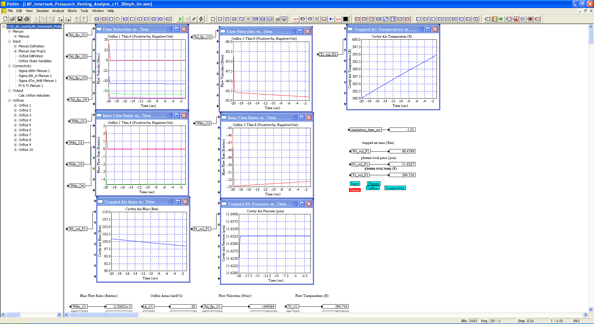
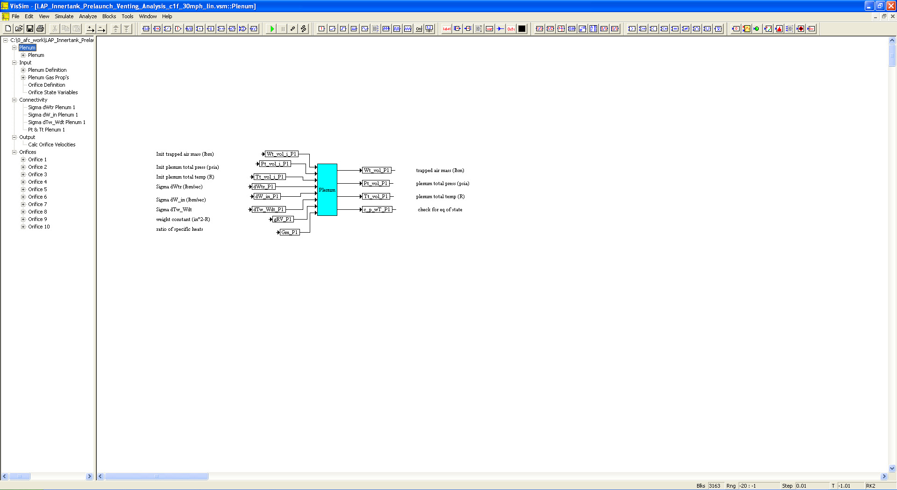
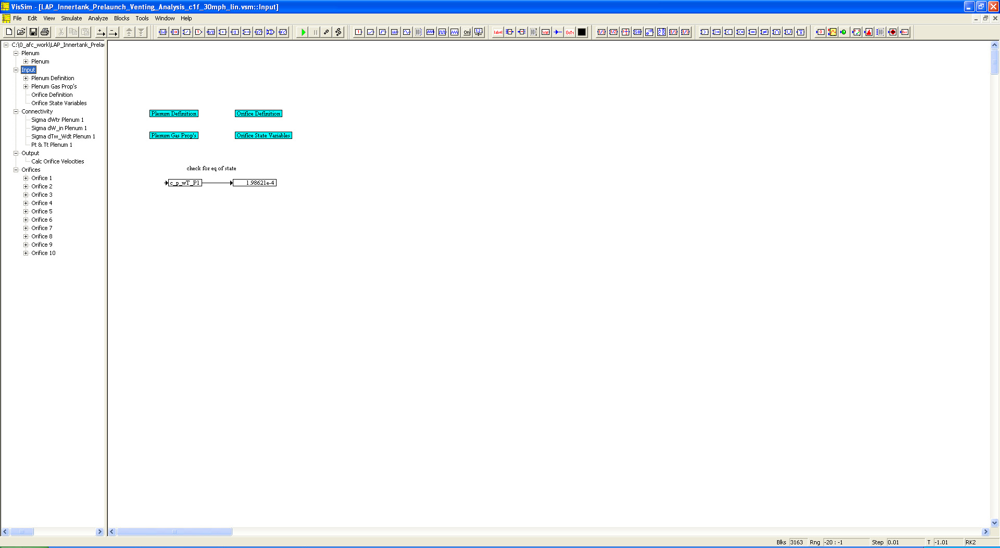
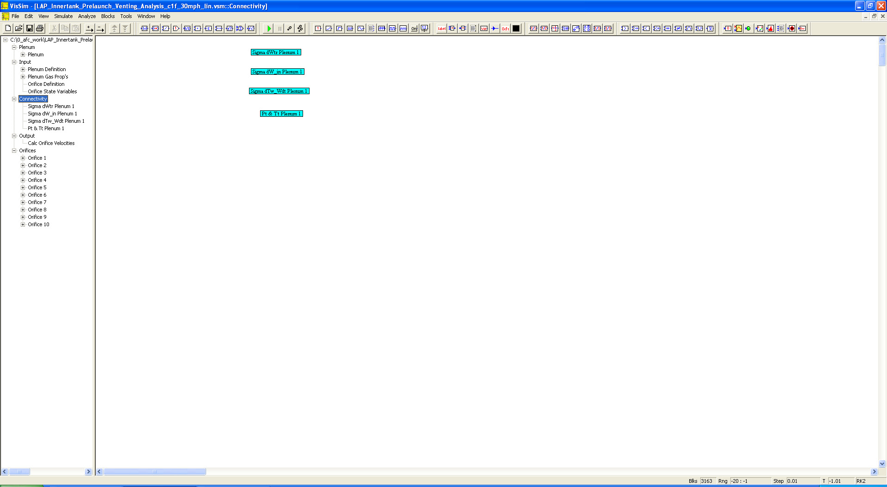
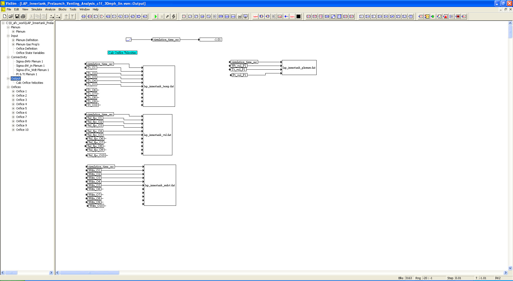
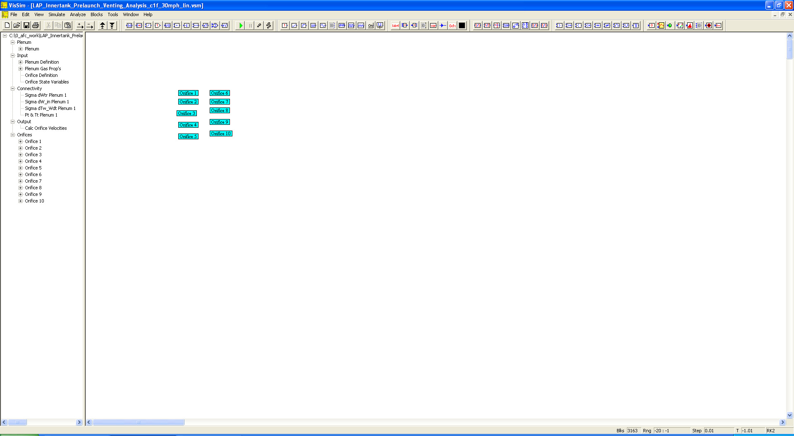

# ========================================
# Prelaunch First-Stage Innertank Venting Analysis using VISSIM:
# ========================================

## Prelaunch First-Stage Innertank with cross-wind Venting Analysis using VISSIM.

##
## I. Operation: "./VISSIM/LAP_Innertank_Prelaunch_Venting_Analysis_c1f_30mph_lin.vsm"

##
## II. Prelaunch LAP Innertank Venting Top Level Diagram:

##
## III. Plenum Sub-System Level Diagram:

##
## IV. Input Sub-System Level Diagram:

##
## V. Connectivity Sub-System Level Diagram:

##
## VI.  Output Sub-System Level Diagram:

##
## VII. Orifices Sub-System Level Diagram:

##
## VIIIa. Results: "./VISSIM/lap_innertank_mdot.dat"
## VIIIb. Results: "./VISSIM/lap_innertank_plenum.dat"
## VIIIc. Results: "./VISSIM/lap_innertank_temp.dat"
## VIIId. Results: "./VISSIM/lap_innertank_vel.dat"

## 
## *Note: 
## 1. Performance Data and Analysis performed using VISSIM, ( https://web.solidthinking.com/vissim-is-now-solidthinking-embed )

